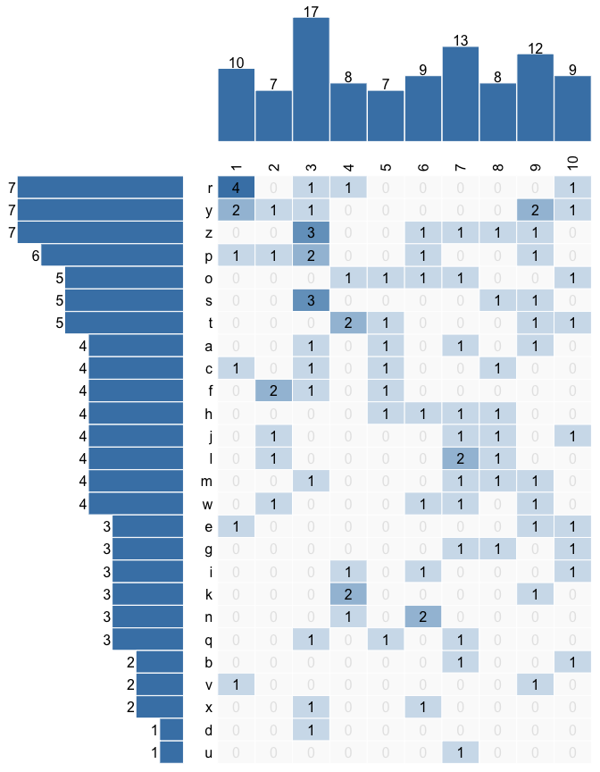

README
================

``` r
library(EvidMap)
library(grid)
dat <- data.frame(a = sample(x = letters, size = 100, replace = TRUE),
                  b = sample(x = 1:10, size = 100, replace = TRUE))
marg_t <- 2
marg_l <- 2
marg_bar_top <- c(0, marg_l, 0, 0)
marg_evid_map <- c(0, marg_l, marg_t, 0)
panel_heights <- c(1, 5)
pushViewport(plotViewport(c(0.5, 0.5, 1, 0.5)))
pushViewport(viewport(layout = grid.layout(nrow = 2, ncol = 2,
                                           widths = c(1.5, 3.5),
                                           heights = c(1, 5))))

# Top bar for evid map 1
pushViewport(viewport(layout.pos.row = 1, layout.pos.col = 2))
plot_bar_col(var_col = dat$b, margins = marg_bar_top)
popViewport()

# Left bar for evid map 1
pushViewport(viewport(layout.pos.row = 2, layout.pos.col = 1))
plot_bar_row(var_row = dat$a, margins = c(0, 0.5, marg_t, 0))
popViewport()

# Evid map 1
pushViewport(viewport(layout.pos.row = 2, layout.pos.col = 2))
spec_levels <- plot_evid_map(var_row = dat$a, var_col = dat$b, 
                             margins = marg_evid_map, 
                             # Can adjust color and fill for 0 cells:
                             color_zero = "grey90", fill_zero = "grey98")
popViewport()

popViewport()
popViewport()
```

<!-- -->
